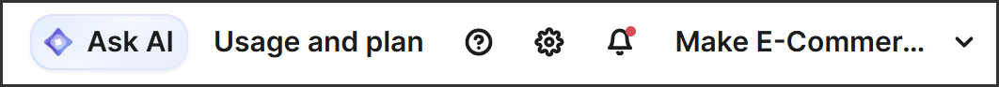
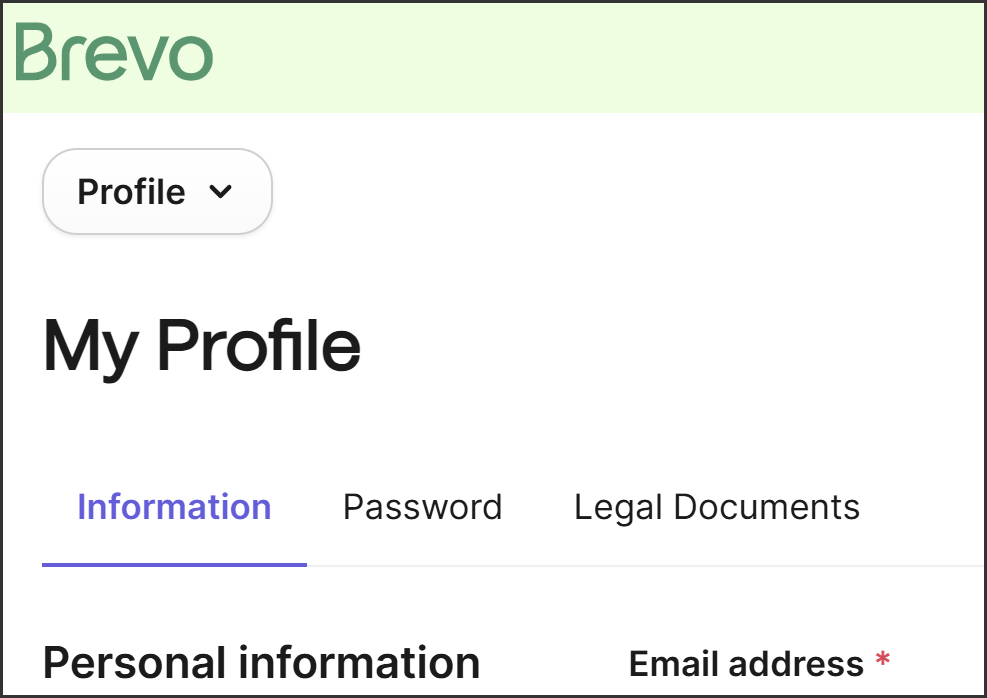
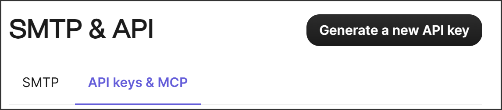
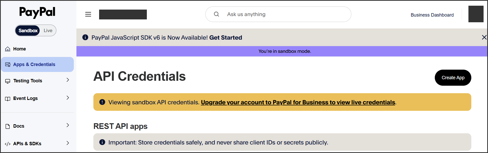
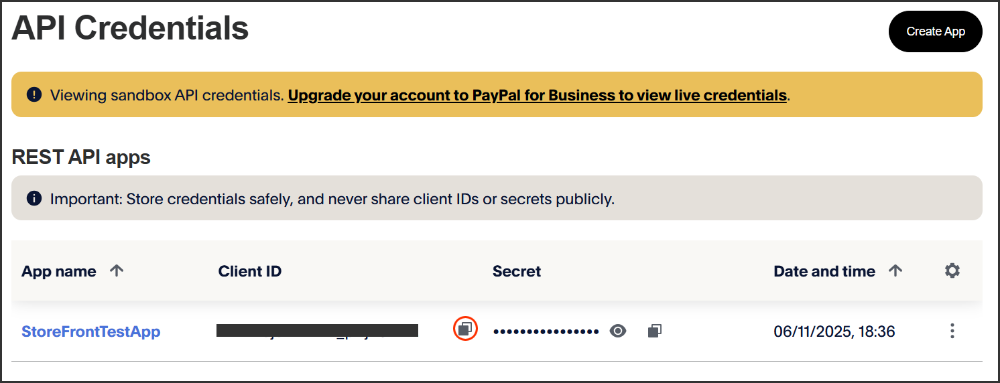

# Storefront

[](https://opensource.org/licenses/MIT)

> 📖 **Official Companion Code Repository**  
> This open-source repository contains the complete working source code and chapter-by-chapter snapshots for the 300-page eBook: **Building your first Shopping Basket: A friendly guide to C# and Razor Pages**.  
>  
> 👉 **[Get the Building Your First Shopping Basket eBook on Gumroad](https://craigster062.gumroad.com/l/build-ecommerce-with-dotnet)** — *Includes the full eBook, with all explanations, diagrams, and step‑by‑step guidance that accompany the source code in this repository.*

---

## 🛠️ Tech Stack & Key Technologies

* **Language:** C#
* **Framework:** ASP.NET Core
* **Database:** PostgreSQL / SQLite
  SQLite is used for local development and is prefigured in the project. PostgreSQL is only required for Railway deployment (Chapter 15) and is set up in the cloud.
* **Authentication & Security:** Native .NET Password Hashing
* **Deployment & Tooling:** Railway CLI for deployment, Git for version control

---

## ✨ Features & What You'll Learn

- [x] **Razor Pages UI Architecture:** Clean, server‑rendered HTML with PageModels, form handling, validation, and simple, maintainable UI flows.
- [x] **Pragmatic Service Architecture:** Simple, clean separation of concerns using C# services, intentionally avoiding over-engineered abstractions and interfaces so the code remains easy to follow.
- [x] **Secure Authentication:** Secure password hashing using native .NET cryptographic primitives.
- [x] **Database Integration:** Fully typed queries, schema migrations and relational modeling.
- [x] **Third-Party API Integrations:** Step-by-step implementation of real-world external services, including PayPal payments and Brevo transactional emails.

---

## 🛒 Core Basket Functionality
- [x] **Add, update, and remove items:** Full item‑level control inside the basket.
- [x] **Checkout via PayPal:** Secure payment processing simulation via PayPal sandbox environment.
- [x] **Order confirmation emails:** Transactional emails via Brevo.
- [x] **Order history and receipts:** Users can view past purchases. 
- [x] **Product catalogue maintenance:** Admin‑level tools for creating, editing and managing products, prices, descriptions and order fulfilment.
---

## 📂 Chapter-by-Chapter Code Snapshots

If you are following along with the book, each chapter corresponds to a working code snapshot. If you get stuck on a bug or typo, diff your code against that chapter's snapshot:

| Chapter | Topic / Feature Implemented | Tag Link |
| :--- | :--- | :--- |
| **Chapter&nbsp;1** | Preparing Your Environment and Creating the Storefront Project | `chapter‑1` |
| **Chapter&nbsp;2** | Building the Shopping Basket | `chapter‑2` |
| **Chapter&nbsp;3** | Adding Products to the Basket | `chapter‑3` |
| **Chapter&nbsp;4** | Setting Up PayPal for Your Storefront | `chapter‑4` |
| **Chapter&nbsp;5** | Personalizing Your App: Logos, Colours and Branding | `chapter‑5` |
| **Chapter&nbsp;6** | Setting Up a Product Database with SQLite | `chapter‑6` |
| **Chapter&nbsp;7** | Scaffolding the Admin Pages | `chapter‑7` |
| **Chapter&nbsp;8** | Enhancing the Admin Pages with Validation | `chapter‑8` |
| **Chapter&nbsp;9** | Securing the Admin Pages | `chapter‑9` |
| **Chapter&nbsp;10** | Add the Order Confirmation Page | `chapter‑10` |
| **Chapter&nbsp;11** | Set Up the Confirmation Email | `chapter‑11` |
| **Chapter&nbsp;12** | Viewing Order History | `chapter‑12` |
| **Chapter&nbsp;13** | Capturing Customer Shipping Information | `chapter‑13` |
| **Chapter&nbsp;14** | Build the Admin Orders Page | `chapter‑14` |
| **Chapter&nbsp;15** | Deploying Your Storefront | `chapter‑15` |

**Note:** The chapter‑15 tag contains the exact final code snapshot used in the book. When you clone the repository or check out the main branch, you’ll get the same final code plus additional documentation, UI screenshots, and ongoing improvements not included in the book.

---
## 🔧 Prerequisites
**Minimum OS versions**
* Windows 10 or later (recommended)
* macOS 12 or later
* Linux: Ubuntu 22.04+, Debian 12+, Fedora 39+, etc

**.NET SDK 9.0**

Download from https://dotnet.microsoft.com/en-us/download/dotnet/9.0

The project configuration strictly requires a .NET SDK that belongs to the 9.0.1xx Feature Band (where xx represents any two digits from 00 to 99).

**ASP.NET Core Runtime 8.x**

Download from https://dotnet.microsoft.com/en-us/download/dotnet/8.0

**Git**

Download from https://git-scm.com/install/

**Create a GitHub account** if you don't already have one

https://github.com/join 

Visit the link above and follow the sign-up process to create your free account.

**Brevo Account**

* Go to https://www.brevo.com/
* Click Sign Up
* Create a free account
  Brevo’s free plan allows you to send up to 300 emails per day. 
* Confirm your email address when prompted

When you sign up for Brevo, the email address you use during registration is automatically added as your sender address and is verified immediately. It’s best to register using a Gmail, Hotmail, or Outlook account.

Once you’re logged in, you’ll need to generate an API key. This key allows your application to send email through Brevo’s HTTP API.

You need to access the SMTP & API screen; both steps differ slightly between desktop and smaller screens.

**Desktop**
* Open the account dropdown in the top navigation bar.
This contains the name of the company/organization you entered in the Brevo registration process, earlier.
In the case illustrated below, the dropdown is the one containing the text “Make E-Commer…”



* Select MY PROFILE
* Select SMTP & API from the left-hand Settings menu that will subsequently be displayed.


**Smaller Devices**
* Click the icon circled in red below to open the account dropdown.


* Select MY PROFILE
* Click the dropdown button
  This appears at the top of the profile page and is shown below with caption set to Profile



* Select SMTP & API from the dropdown.
  
**All Devices**

Once on the SMTP&API screen, the steps are the same regardless of your device type.

* Click API KEYS & MCP.
* Click GENERATE A NEW API KEY.
  


* Name it and click GENERATE
* Copy the API key
  
  A dialog will appear: copy the API key and paste it somewhere safe; you’ll add it to your user secrets as described in the **Configuration** section.
  **Note:** Brevo API keys are shown only once. If you lose it, you must generate a new one.


**Paypal Account**

If you do not already have an account, create one at https://www.paypal.com.  You can choose either Personal or Business but Personal is sufficient for now.

**Paypal Sandbox App**

* Go to https://developer.paypal.com/dashboard/ and sign in.  
* Ensure you are in Sandbox Mode.
* From the left-hand menu, Click Apps & Credentials and then click Create App.
  
  

* You will need the sandbox app's Client ID for your config (You only need the sandbox Client ID; the Client Secret is not used in this project).  Once your sandbox app is created, it will appear on the same page under Rest APIs and you can copy your Client ID by clicking the highlighted icon, below.
  
  

## Optional Requirements ##

These tools are not required to run the Storefront application.
They are only needed if you are following the book’s development steps or deploying to Railway.

**Node.js**

Required only for Railway deployment (Chapter 15).

**Railway cli**

Required only for Railway deployment (Chapter 15).

**EF Core CLI Tools**

Required only if you want to run or generate migrations.

   ```bash
   dotnet tool install --global dotnet-ef --version 9.0.0
   ```
**ASP.NET Core code generator tool v 9.0.0**

Used in Chapter 7 for scaffolding the admin pages.

   ```bash
   dotnet tool install --global dotnet-aspnet-codegenerator --version 9.0.0
   ```

The site will run without this tool. It is only required if you want to scaffold Razor Pages during development.

**Visual Studio Code**

Download from https://code.visualstudio.com/

Recommended for following the book, but any editor (Visual Studio, Rider, Vim, etc.) will work.

---
## 🚀 Quick Start (Local Setup)

### Configuration

**User Secrets**
* Paypal Sandbox Client Id
  
   ```bash
   dotnet user-secrets set "PayPal:SandboxClientId" "YOUR_SANDBOX_CLIENT_ID"
   ```
* Brevo API Key
  
   ```bash
   dotnet user-secrets set "Email:ApiKey" "YOUR_BREVO_API_KEY"
   ```

**appsettings.Development.json**

The PasswordHash value must be replaced with the hash generated by the GenerateHash page. 

To access this page, check out the chapter-8 tag, run the app and access `http://localhost:PORT_NUMBER/GenerateHash`. The port number appears in the console output when you run dotnet run or dotnet watch; it typically looks like http://localhost:5243.

The site will run even without this value, but admin login will not work until you replace the placeholder.

**Note:** The shop.db SQLite database file is created automatically when you run the app. No manual setup is required.

   ```bash
   {
      "ConnectionStrings": {
         "ShopDbConnection": "Data Source=shop.db"
      },
      "Admin": {
         "PasswordHash": "YOUR_GENERATED_HASH"
      },
      "Email": {
         "FromName": "Storefront",
         "From": "YOUR_REGISTERED_BREVO_EMAIL_ADDRESS"
      }
   }

   ```

### Installation

**Clone the repository**

   ```bash
   git clone https://github.com/Schafline/Storefront.git
   cd Storefront
   ```
**Run the App**

   ```bash
   dotnet restore
   ```
This restores all project dependencies. You only need to run this once after cloning the repository (or whenever you add new NuGet packages).

   ```bash
   dotnet run
   ```

   Or

   ```bash
   dotnet watch
   ```
